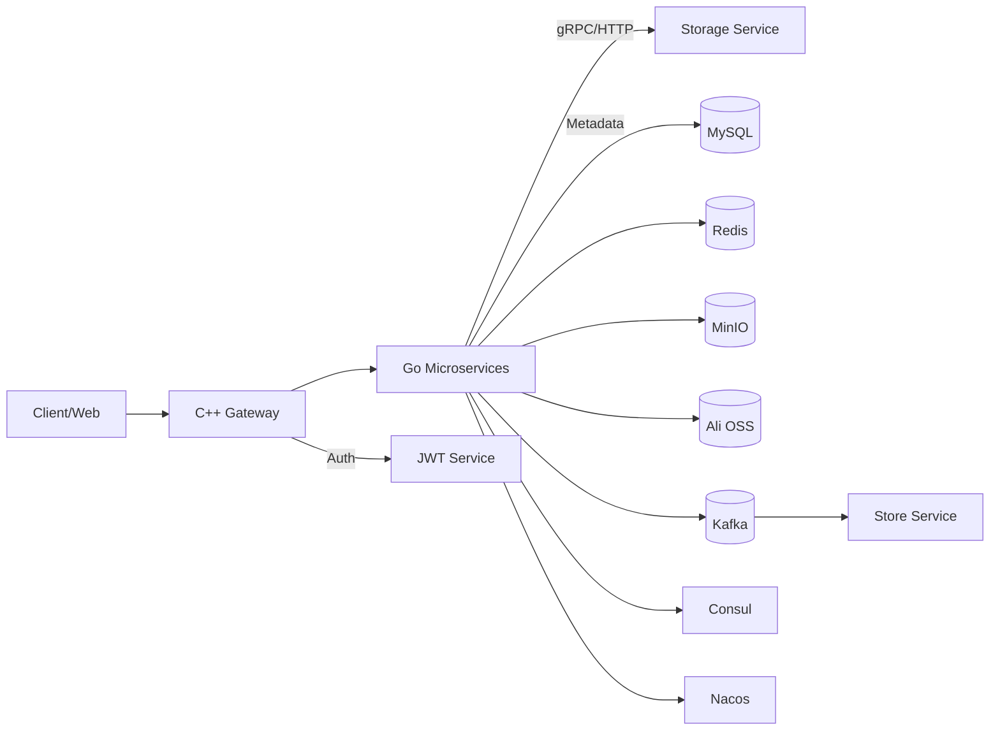

# ☁️ CloudDisk V2

> 一个面向云盘/对象存储场景的多语言微服务项目，包含配置中心、服务发现、存储编排与消息驱动的异步处理能力。

---

## ✨ 项目亮点

- **多语言微服务架构**：Go + C++ 混合实现，覆盖配置、存储、网关、异步任务等核心能力。
- **云存储双通道**：同时支持 **MinIO** 与 **阿里云 OSS**，便于本地/云上切换与扩展。
- **统一配置与热更新**：通过 **Nacos + Viper** 统一配置管理，支持监听热更新。
- **服务注册与发现**：基于 **Consul** 进行服务注册、健康检查与发现。
- **消息驱动处理**：Kafka 消息驱动文件上传/异步处理。
- **安全认证体系**：JWT 鉴权、签发、刷新。

---

## 🧰 工具链 / 技术栈

| 领域     | 技术/工具          | 说明                                    |
| -------- | ------------------ | --------------------------------------- |
| 语言     | Go 1.24 / C++      | Go 负责核心服务，C++ 承载网关与邮件服务 |
| 构建     | Go Modules / CMake | 多语言构建体系                          |
| 通信     | gRPC / Protobuf    | 内部服务通信与协议定义                  |
| 配置     | Nacos + Viper      | 动态配置中心与热更新                    |
| 注册发现 | Consul             | 服务注册、健康检查与发现                |
| 存储     | MinIO / 阿里云 OSS | 对象存储后端                            |
| 数据     | MySQL + Redis      | 关系存储与缓存                          |
| 消息     | Kafka (Sarama)     | 异步任务与事件驱动                      |
| 安全     | JWT                | Token 生成、校验与刷新                  |

---

## 🏗️ 架构概览



---

## 📂 目录结构（二级）

```
.
├── backword_server/          # 后端服务集合
│   ├── AI_server/            # AI/MCP 相关能力
│   └── mcp_server/           # MCP Server 实现
├── forward_part/             # C++ 网关与前置服务
│   ├── gateway/              # 网关主程序（controllers/filters 等）
│   ├── internal/             # C++ 内部通用组件（Consul 适配等）
│   ├── config/               # 前置配置
│   ├── logs/                 # 运行日志
│   └── static/               # 静态资源
├── other_srv/                # 其他服务
│   ├── store_srv/            # Kafka 驱动的异步存储服务（kafka/localfile）
│   └── email_srv/            # 邮件服务（Kafka + Redis + C++）
├── internal/                 # Go 核心基础组件（配置/存储/JWT/DB等）
├── proto/                    # Protobuf / gRPC 协议定义
├── scripts/                  # 部署脚本（Nacos/Consul/Kafka/MinIO 等）
└── storage/                  # 存储数据目录（hash 分片）
```

---

## ✅ 功能说明

### 1. 配置中心与热更新

- 通过 **Nacos** 获取统一配置，并使用 **Viper** 解析。
- 支持 **配置监听**，实现热更新能力。

相关实现：`internal/viper_config_centre.go`

### 2. 服务注册与发现

- 使用 **Consul** 实现服务注册、健康检查与发现。
- 同时支持 gRPC 与 HTTP 服务的注册。

相关实现：`internal/concul.go`

### 3. 存储后端

- **MinIO**：本地/私有对象存储。
- **Ali OSS**：云上对象存储。
- 提供上传、下载、删除、对象检测、预签名 URL 等功能。

相关实现：

- `internal/minio.go`
- `internal/ali_oss.go`

### 4. 安全认证

- JWT token 生成、校验、刷新。

相关实现：`internal/jwt.go`

### 5. Kafka 异步任务

- 基于 **Sarama** 消费 Kafka topic，进行文件上传等异步任务处理。

相关实现：`other_srv/store_srv/main.go`

### 6. 邮件服务（C++）

- 基于 C++ 实现邮件服务与 Kafka 消费/生产适配。

相关实现：`other_srv/email_srv/*`

---

## 🔧 功能实现细节（含 MCP 实现说明）

### ✅ MCP（Model Context Protocol）

项目中的 MCP Server 位于后端服务目录：`backword_server/AI_server` 与 `backword_server/mcp_server`。

- **实现位置**：`backword_server/AI_server`、`backword_server/mcp_server`
- **依赖引入**：Go module 中已包含 `github.com/mark3labs/mcp-go` 依赖（`go.mod`）。
- **服务发现配置**：配置中心中已预留 MCP 服务注册配置项（`internal/concul.go` 中的 `ConsulConfig.MCPSrv`）。

---

## 🚀 快速开始（建议）

> 当前仓库包含多组件，请根据实际部署环境准备依赖：Nacos、Consul、Kafka、MySQL、Redis、MinIO 或 Ali OSS。

1. 准备配置中心（Nacos），并推送 `clouddisk.json` 配置。
2. 启动 Consul 与 Kafka。
3. 分别启动 Go/C++ 服务模块。

---

## 📌 参考风格（GitHub 展示范例）

项目展示结构参考以下风格：

- [Awesome Go](https://github.com/avelino/awesome-go)
- [MinIO](https://github.com/minio/minio)
- [grpc/grpc](https://github.com/grpc/grpc)

---

## 📜 License

本项目暂未添加 License，请根据团队需求补充。

---

## 🙌 贡献

欢迎提交 Issue / PR 共同完善此云盘系统。只需确保遵循目录结构与编码规范。
<<<<<<< ours

=======

> > > > > > > theirs
